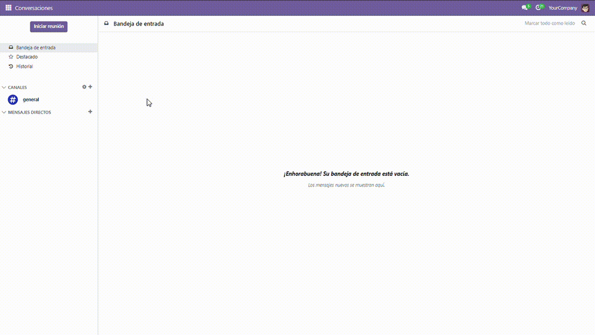
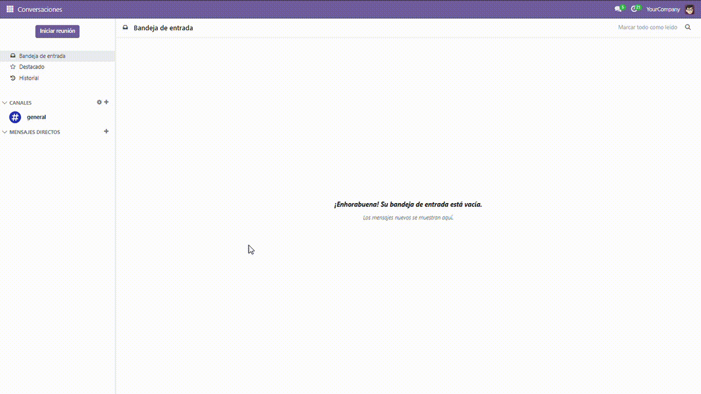
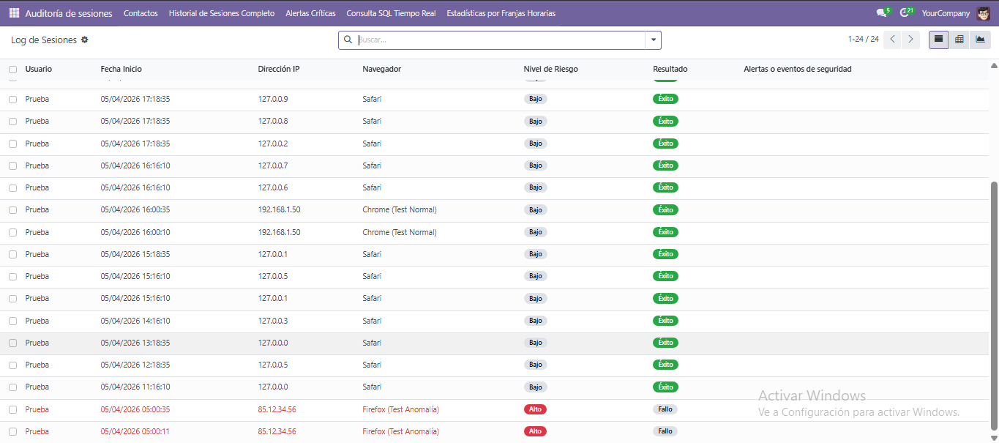
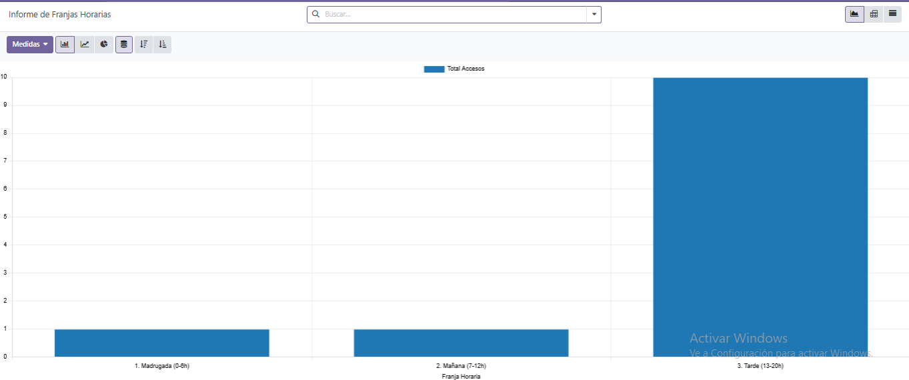
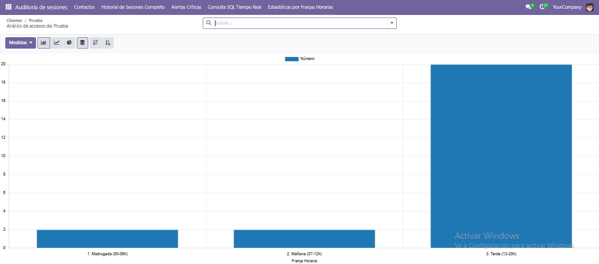
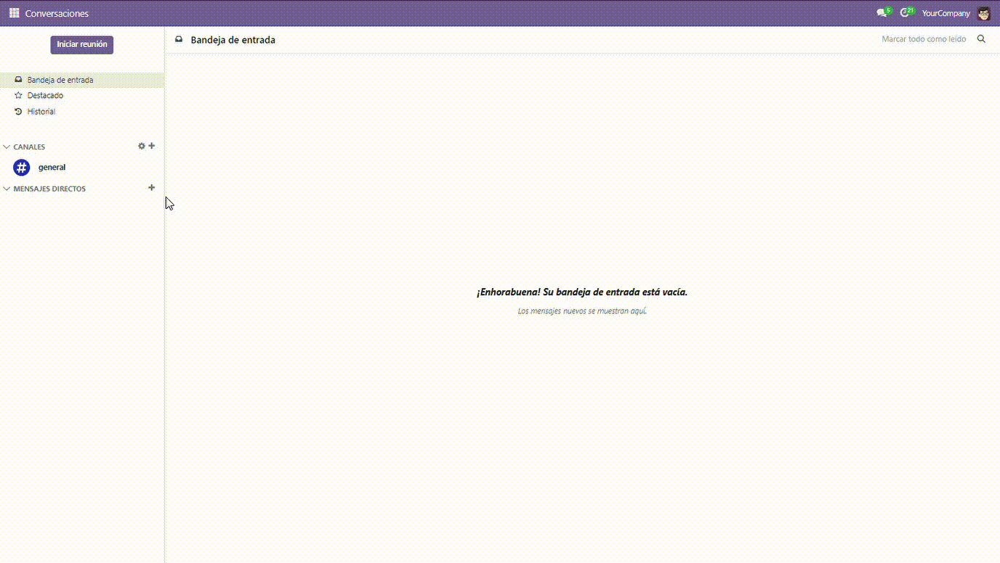

# Autenticación Inteligente y Detección de Fraude

Módulo de **Odoo 17** acompañado de una **app móvil en React Native (Expo)** que se encarga de registrar y analizar todos los intentos de inicio de sesión para detectar comportamientos sospechosos antes de que se produzca un acceso no autorizado.

La idea del proyecto es añadir a Odoo un sistema de seguridad parecido al que tienen las apps bancarias: cada vez que alguien quiere entrar a la cuenta desde el navegador, el usuario recibe una notificación push en el móvil para confirmar o denegar el acceso. Por detrás, un modelo de Machine Learning revisa la hora, la ubicación y los intentos fallidos para decidir si ese acceso encaja con el comportamiento habitual del usuario.

---

## Tecnologías utilizadas

| Componente | Tecnología | Versión |
|---|---|---|
| ERP / Backend | Odoo | 17.0 |
| Lenguaje backend | Python | 3.10 |
| Base de datos | PostgreSQL | 15 |
| Machine Learning | scikit-learn (One-Class SVM) | 1.x |
| Datos numéricos | NumPy / Pandas | últimas |
| Vistas e informes | XML / QWeb | — |
| App móvil | React Native + Expo | Expo 54 / RN 0.81 |
| Navegación móvil | Expo Router | 6.x |
| Notificaciones push | Firebase Cloud Messaging | v1 |
| Contenedores | Docker / Docker Compose | últimas |

---

## Requisitos previos

Para levantar el proyecto solo hace falta tener instalado:

- **Docker** y **Docker Compose** (para el backend y la base de datos)
- **Git**
- **Node.js 20.x** y **npm** (solo si se quiere ejecutar la app móvil)
- **Expo Go** o un emulador Android (para probar la app móvil)

> No hace falta instalar Python, Postgres ni Odoo a mano: la imagen de Docker ya los incluye.

---

## Instalación paso a paso

### 1. Clonar el repositorio

```bash
git clone https://github.com/JesusBenitezPitt/Proyecto-Intermodular-2025-26
cd Proyecto-Intermodular-2025-26
```

### 2. Levantar el backend (Odoo + PostgreSQL)

```bash
docker compose up -d
```

Esto descarga la imagen `jesusbenitezpitt/odoo-proyecto:latest` (Odoo 17 con scikit-learn ya instalado) y arranca también un contenedor de Postgres 15.

### 3. Acceder a Odoo y crear la base de datos

1. Abrir el navegador en `http://localhost:8069`
2. Crear una base de datos llamada **`odoo`** (importante, ese nombre es el que usa la app móvil)
3. Definir el correo y contraseña del administrador

### 4. Instalar el módulo

Dentro de Odoo, ir a **Aplicaciones → Quitar el filtro de Apps → Buscar "Autenticación Inteligente" → Instalar**.


### 5. (Opcional) Preparar la app móvil

```bash
cd mobile/MovilProyecto
npm install
npx expo start
```

Antes de arrancar hay que ajustar la IP del servidor en `mobile/MovilProyecto/constants/config.js`:

```js
export const ODOO_CONFIG = {
  BASE_URL: 'http://<IP_DEL_PC>:8069',
  DB: 'odoo',
};
```

> Si se prueba la app desde el móvil físico, el PC y el móvil tienen que estar en la misma red WiFi.

---

## Instrucciones de ejecución

Una vez instalado el módulo, en el menú principal de Odoo aparece la sección **"Auditoría de sesiones"**, que da acceso a:

- Contactos (con la pestaña de Seguridad nueva)
- Historial de Sesiones Completo
- Alertas Críticas
- Consulta SQL en Tiempo Real
- Estadísticas por Franjas Horarias

Para parar los contenedores:

```bash
docker compose down
```

Si se quieren borrar también los datos guardados de Odoo y la base de datos (hard reset):

```bash
docker compose down -v
```

---

## Configuración necesaria

### Variables de entorno

Las variables están definidas en `docker-compose.yml`:

| Variable | Valor por defecto | Descripción |
|---|---|---|
| `HOST` | `db` | Nombre del contenedor de Postgres |
| `USER` | `odoo` | Usuario de la base de datos |
| `PASSWORD` | `odoo` | Contraseña de la base de datos |
| `FIREBASE_JSON` | `/var/lib/odoo/firebase_configs/firebase-sdk.json` | Ruta al archivo de credenciales de Firebase |

### Puertos

| Puerto | Servicio |
|---|---|
| 8069 | Interfaz web de Odoo |
| 5432 | PostgreSQL |

### Firebase

Para que las notificaciones push funcionen hay que dejar el archivo de credenciales en:

```
config/firebase-sdk.json
```

(Es la clave de cuenta de servicio que se descarga desde Firebase Console → Configuración del proyecto → Cuentas de servicio).

### Credenciales de prueba

| Rol | Usuario | Contraseña |
|---|---|---|
| Administrador | `prueba@prueba.com` | `odoo` |
| Usuario normal | `prueba2@prueba.com` | `odoo` |

> Estas credenciales se crean al instalar el módulo con datos de demo ya configurados y el usuario prueba creado. Si se monta una base de datos limpia, se usan las que se hayan definido al crearla.

---

## Funcionalidades implementadas

### Backend (Odoo)
- [x] Registro automático de cada intento de login (éxito, fallo o bloqueo)
- [x] Almacenamiento de IP, fecha, hora, navegador y franja horaria
- [x] Detección automática del navegador a partir del User-Agent
- [x] Vista de lista del historial completo con indicadores visuales de riesgo
- [x] Pestaña "Seguridad" en la ficha de cada contacto
- [x] Botón en la ficha del contacto para generar simulaciones de accesos
- [x] Informe PDF de seguridad por contacto
- [x] Vista de Alertas Críticas filtrada por riesgo alto
- [x] Bloqueo automático de la cuenta tras N intentos fallidos
- [x] Análisis del nivel de riesgo mediante IA (One-Class SVM de scikit-learn)
- [x] Geolocalización del acceso a través de la IP (ip-api.com)
- [x] Informe de patrones temporales por franja horaria (global e individual)
- [x] Consulta SQL en tiempo real para detectar IPs sospechosas
- [x] Endpoint REST `/api/auth/login` con flujo 2FA
- [x] Endpoints REST para notificaciones, logs, registro de token y validación 2FA
- [x] Notificaciones al administrador cuando se detecta un acceso
- [x] Notificación al usuario para confirmar el acceso desde otra ubicación

### App móvil (React Native)
- [x] Pantalla de login contra el endpoint de Odoo
- [x] Registro automático del token de Firebase en el contacto
- [x] Recepción de notificaciones push (foreground y background)
- [x] Pantalla para aprobar o denegar el acceso (2FA)
- [x] Listado de notificaciones con marcado de leídas
- [x] Listado de logs de acceso del usuario
- [x] Badge con el número de notificaciones sin leer
- [x] Cabecera con la foto y el nombre del usuario
- [x] Cierre de sesión con limpieza del token en Odoo

---

## Implementaciones futuras

Cosas que se han quedado fuera del alcance pero que tendría sentido añadir más adelante:

- [ ] Aviso por correo al administrador cuando un usuario es bloqueado
- [ ] Configurador para ajustar desde Odoo el umbral de sensibilidad de la IA
- [ ] Dashboard general en la pantalla de inicio del módulo (KPIs)
- [ ] Soporte multi-idioma de la app móvil (ahora solo está en español)
- [ ] Test automatizados de los endpoints REST

---

## Problemas conocidos

- **Geolocalización en local**: cuando Odoo se ejecuta en local, la IP que recibe es `127.0.0.1`, así que la ubicación se sustituye por una posición fija (Madrid) para que la IA no se confunda. En producción, con IP pública real, la geolocalización funciona normal.
- **Login 2FA bloqueante**: el endpoint de login espera la respuesta del móvil hasta 120 segundos. Si Odoo está detrás de un proxy con un timeout más bajo, hay que ampliarlo.
- **Token de Firebase**: si el usuario reinstala la app móvil, el token cambia. Hay que volver a iniciar sesión para que se actualice.
- **Modo desarrollo de la app**: con `expo start` en modo Expo Go no funcionan las notificaciones push. Para probarlas hay que usar un *development build* (`eas build --profile development`).

---

## Capturas de pantalla

### Instalación del módulo


### Funcionalidad principal (vista admin)


### Interfaz de usuario completa


### Análisis de IA por franjas horarias


> Los dos últimos registros son de madrugada, justo cuando el usuario rompe con su rutina habitual de acceso. La IA los detecta como riesgo alto.

### Informe global por franjas horarias


### Informe individual por franjas horarias


### Módulo instalado y menús


---

## Estructura del repositorio

```
Proyecto-Intermodular-2025-26/
├── backend/
│   ├── Dockerfile               # Imagen de Odoo con sklearn y dependencias
│   └── addons/
│       └── autenticacion_inteligente/
│           ├── __manifest__.py
│           ├── controllers/     # Endpoints REST para la app móvil
│           ├── models/          # Logs, usuario, login, notificaciones
│           ├── reports/         # Vistas SQL y PDF
│           ├── security/        # Permisos
│           └── views/           # XML de vistas y menús
├── mobile/
│   └── MovilProyecto/           # App React Native (Expo)
│       ├── app/                 # Pantallas (login, tabs, 2FA…)
│       ├── components/
│       ├── services/            # Cliente HTTP de Odoo y Firebase
│       └── constants/config.js  # IP del servidor y nombre de la BD
├── docs/
│   ├── capturas/                # Imágenes y GIFs del README
│   └── instalacion_modulo/
└── docker-compose.yml
```

---

## Autor y contacto

**Jesús Benítez Pitt**
2º DAM — Curso 2025/2026
IES — Proyecto Intermodular
Profesora: María Sierra Escalera Pérez

GitHub: [@JesusBenitezPitt](https://github.com/JesusBenitezPitt)
